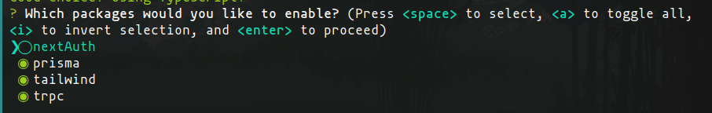

<!-- Improved compatibility of back to top link: See: https://github.com/othneildrew/Best-README-Template/pull/73 -->
<a name="readme-top"></a>

<h1 align="center">T3 for Web3</h3>

<p align="center">Ejemplo de una aplicación full stack para web3 usado T3 Stack.</p>

La idea es crear un template donde tengas todo configurado para que la aplicación tenga:

- Un inicio de session con la cartera de MetaMask
- Typescript everywhere: tener inferencia de tipos a partir del abi del smartcontract tanto para wagmi como para ethers.
- Aprovechar todo lo que ofrece [create-t3](https://create.t3.gg) para una aplicación full-stack.j

## Tecnologías usadas

 [![Next][Next.js]][Next-url]
 [![Tailwind][Tailwind]][Tailwind-url]
 [![Prisma][Prisma]][Prisma-url]
 [![Typescript][Typescript]][Typescript-url]
 [![tRPC][tRPC]][tRPC-url]

- [Iron-session](https://github.com/vvo/iron-session)
- [Siwe](https://login.xyz/)
- [Wagmi](https://wagmi.sh/)
- [Ethers](https://docs.ethers.org/v5/)

## ¿Cómo se ha creado?

### Create T3 App

Se ha comenzado con el comando de `create-t3` (en mi caso lo hago con [pnpm](https://pnpm.io/))

```sh
pnpm create t3-app@latest
```

- Seleccionamos `Typescript`

y luego

- Seleccionamos todas las tecnología exceptuado NextAuth



- Le damos a que sí a todo lo demás

### Instalar `iron-session`, `wagmi` , `ethers` y `siwe`

```sh
pnpm add iron-session wagmi ethers siwe@beta
```

### Configurar `iron-session`

Creamos un fichero con el tipo de IronSession en [`src/types/iron-session/index.d.ts`](src/types/iron-session/index.d.ts) con lo siguiente:

```typescript
// src/types/iron-session/index.d.ts
import "iron-session";
import type { SiweMessage } from "siwe";

declare module "iron-session" {
  interface IronSessionData {
    nonce?: string;
    siwe?: SiweMessage;
    issuedAt?: string;
    expirationTime?: string;
    user?: {
      address: string;
      name: string;
    };
  }
}

```

Para integrar la session de iron-session con trpc, vamos modificar [src/server/trpc/context.ts](src/server/trpc/context.ts)

Así en los "métodos" de trpc tendremos el `ctx` la session de quien está realizando la petición a nuestro backend

```typescript
import { type inferAsyncReturnType } from "@trpc/server";
import { type CreateNextContextOptions } from "@trpc/server/adapters/next";
import type { IronSession } from "iron-session";
import { getIronSession } from "iron-session";
import { sessionOptions } from "../../lib/iron-session";

import { prisma } from "../db/client";

/**
 * Replace this with an object if you want to pass things to createContextInner
 */
type CreateContextOptions = {
  session: IronSession;
};

/** Use this helper for:
 * - testing, so we dont have to mock Next.js' req/res
 * - trpc's `createSSGHelpers` where we don't have req/res
 * @see https://create.t3.gg/en/usage/trpc#-servertrpccontextts
 **/
export const createContextInner = async (opts: CreateContextOptions) => {
  return {
    prisma,
    session: opts.session,
  };
};

/**
 * This is the actual context you'll use in your router
 * @link https://trpc.io/docs/context
 **/
export const createContext = async (opts: CreateNextContextOptions) => {
  const { req, res } = opts;

  const session = await getIronSession(req, res, sessionOptions);

  return await createContextInner({ session });
};

export type Context = inferAsyncReturnType<typeof createContext>;
```

<!-- MARKDOWN LINKS & IMAGES -->
<!-- https://www.markdownguide.org/basic-syntax/#reference-style-links -->
[Next.js]: https://img.shields.io/badge/next.js-000000?style=for-the-badge&logo=nextdotjs&logoColor=white
[Next-url]: https://nextjs.org/
[Prisma]: https://img.shields.io/badge/prisma-1a202c?style=for-the-badge&logo=prisma&logoColor=white
[Prisma-url]: https://www.prisma.io/
[tRPC]:https://img.shields.io/badge/trpc-398CCB?style=for-the-badge&logo=trpc&logoColor=white
[tRPC-url]: https://trpc.io/
[Tailwind]: https://img.shields.io/badge/tailwind-0A1123?style=for-the-badge&logo=TailwindCSS&logoColor=38BDF8
[Tailwind-url]: https://tailwindcss.com/
[Typescript]: https://img.shields.io/badge/typescript-007ACC?style=for-the-badge&logo=typescript&logoColor=white
[Typescript-url]: https://www.typescriptlang.org/
